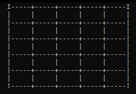
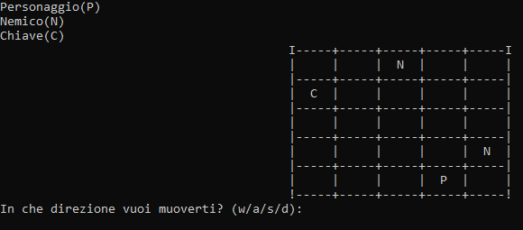
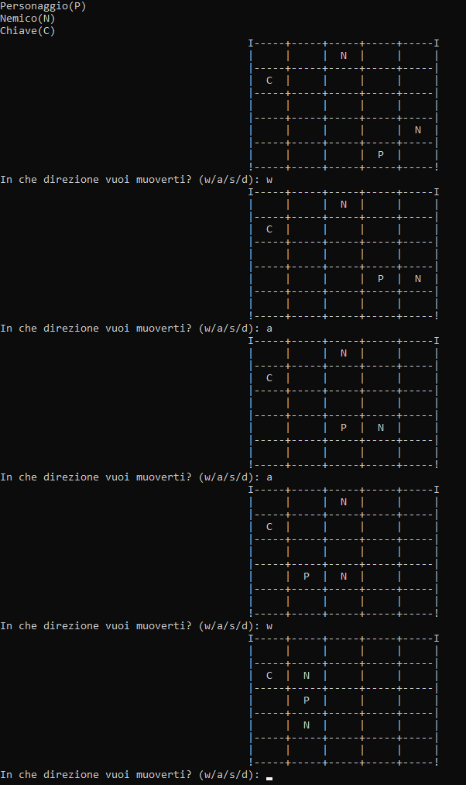
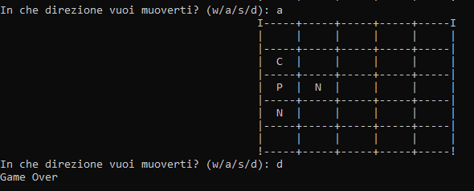
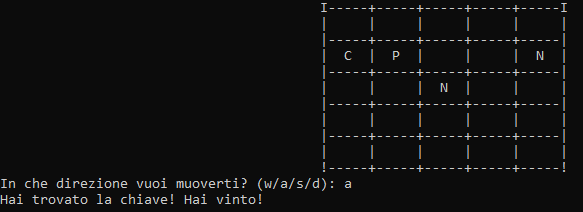

# ProgettoC

24/04/2024

Gioco creato con il linguaggio C++, per creare la grafica del gioco useremo delle matrici per caricare la mappa del livello.
I livelli saranno 5 in aggiunta alla casa del personaggio.

26/04/2024

Livello 1 completato senza non troppi problemi, l'unica sfida è stato creare l'algoritmo per muovere i nemici in modo sensato.
Ma soprattutto sono fiero di come è venuto il movimento nella matrice e del personaggio e nemici.

-**Generazione Nemici:**

-**Movimento:**

-**Morte personaggio:**

-**Vittoria personaggio:**

